## Nostr NIPs for Culture Bridge

Updated, categorized, and prioritized list of Nostr Improvement Proposals (NIPs) relevant to the Culture Bridge platform. This expands the earlier list, fills key gaps (identity, delegation, structured updates, safety, media, payments), and refines use cases to match emerging feature needs (exhibitions, oral histories, community collaboration, stewardship of sensitive knowledge).

Legend: Priority = (E) Essential now, (R) Recommended soon, (F) Future / optional.

### 1. Core & Protocol Foundations

- **(E) NIP-01 – Basic protocol**  
   Use: Baseline event model (signatures, kinds) for all persisted cultural records (stories, exhibitions, metadata).
  _Dependencies:_ None (root). _Enables:_ All other NIPs.
- **(E) NIP-19 – bech32 identifiers**  
   Use: Encode/parse npub / nsec / note / nprofile / naddr for user-facing links & deep linking into exhibitions or curated lists.
  _Dependencies:_ NIP-01 (event/pubkey primitives). _Enables:_ Clean UX for referencing events (NIP-23, 33, 51) and identity trust flows (NIP-05, 26).
- **(R) NIP-11 – Relay information document**  
   Use: Relay capability introspection (admission, retention) to prefer culturally aligned relays (e.g., long-term archival vs. short‑lived chat).
  _Dependencies:_ NIP-01. _Enables:_ Strategic relay selection policies, dynamic UI warnings for retention vs. sensitivity (with NIP-36/70).
- **(R) NIP-12 – Generic tag queries**  
   Use: Efficient filtered discovery of exhibitions/resources by region, material, era tags (paired with labeled events / lists).
  _Dependencies:_ NIP-01; synergizes with structured tagging via NIP-68. _Enables:_ Search/filter endpoints & faceted navigation.
- **(R) NIP-42 – Authentication**  
   Use: Auth flow with relays to gate publishing to approved heritage-preserving relays.
  _Dependencies:_ NIP-01, optionally NIP-05 for human identifier mapping. _Enables:_ Moderated write-paths, curated relay admission.
- **(R) NIP-65 – Relay list metadata**  
   Use: Users (or institutional curators) publish recommended relay sets for heritage preservation vs. real‑time discussion.
  _Dependencies:_ NIP-01, optionally signed trust context from NIP-05 / NIP-19 forms. _Enables:_ Relay trust bundles per community.

### 2. Identity, Delegation & Account Safety

- **(E) NIP-05 – DNS-based identification**  
   Use: Human‑readable cultural custodian / institution identities (e.g. `elders@culturebridge.org`) improving trust.
  _Dependencies:_ NIP-01. _Enables:_ Stronger delegation (NIP-26), signing UX (NIP-46), authenticated HTTP flows (NIP-98).
- **(R) NIP-39 – External identities**  
   Use: Link to museum sites, academic ORCID, community organizations.
  _Dependencies:_ NIP-01, complements NIP-05. _Enables:_ Cross-platform credibility & provenance UI.
- **(R) NIP-26 – Delegated event signing**  
   Use: Institutions delegate publishing rights to staff keys without exposing custodial private keys.
  _Dependencies:_ NIP-01, NIP-05 (for recognizable delegator), NIP-19 (addressable keys). _Enables:_ Safe multi-user institutional accounts.
- **(R) NIP-46 – Nostr Connect**  
   Use: Secure remote signing (user keeps keys in mobile signer while using web app UI).
  _Dependencies:_ NIP-01, optional NIP-05 for clearer prompts. _Enables:_ Key isolation, progressive enhancement of signing security.
- **(R) NIP-98 – HTTP Auth (signing arbitrary payloads)**  
   Use: Authenticated API interactions (upload endpoints, moderation dashboards) without raw key leakage.
  _Dependencies:_ NIP-01; benefits from NIP-05 for identity display. _Enables:_ Off-relay service integrations (media processing pipeline, moderation ops).

### 3. Content Creation, Curation & Versioning

- **(E) NIP-23 – Long-form content**  
   Use: In‑depth cultural narratives, ethnographic essays, exhibition descriptions.
  _Dependencies:_ NIP-01, optional nicer referencing via NIP-19. _Enables:_ Rich narrative layer to anchor highlights (NIP-84) and lists (NIP-51).
- **(R) NIP-33 – Parameterized replaceable events**  
   Use: Updatable canonical exhibition records (slug as d-tag) while preserving immutable artifact/event history separately.
  _Dependencies:_ NIP-01; benefits from NIP-68 for stable tag dimensions. _Enables:_ Mutable canonical record strategy (reduces duplication), SEO-friendly updates.
- **(R) NIP-51 – Lists**  
   Use: Curated sets (featured elders, learning pathways, thematic bundles, “regional weaving patterns”).
  _Dependencies:_ NIP-01, referencing improvements via NIP-19. _Enables:_ Thematic navigation, saved pathways, recommendation seeds.
- **(R) NIP-84 – Highlights**  
   Use: Community‑sourced signal surfacing educationally impactful passages or artifact moments.
  _Dependencies:_ NIP-01, content sources (NIP-23/33). _Enables:_ Lightweight relevance scoring, pedagogical modules.
- **(R) NIP-68 – Labeled events**  
   Use: Structured metadata labeling (material, region, language, period) for faceted browsing & search.
  _Dependencies:_ NIP-01. _Enables:_ Search (NIP-12), curated taxonomies, analytics segmentation.
- **(R) NIP-71 – Video events**  
   Use: Referencing hosted performance/ritual recordings or interview clips.
  _Dependencies:_ NIP-01; may link to canonical metadata (NIP-94) for technical descriptors.
- **(R) NIP-94 – File metadata**  
   Use: Canonical references to high‑resolution images, audio field recordings, 3D scans; attach checksums & media dimensions.
  _Dependencies:_ NIP-01. _Enables:_ Integrity verification, derivative generation pipeline, deduplication.
- **(F) NIP-96 – HTTP file storage**  
   Use: Workflow to publish artifacts to remote storage gateways and reflect stable references on Nostr.
  _Dependencies:_ NIP-94 (metadata pairing), NIP-01. _Enables:_ Integrated media ingest -> event publish automation.

### 4. Community Interaction & Communication

- **(R) NIP-02 – Contact list & petnames**  
   Use: Trust graphs; local naming for elders in indigenous languages.
  _Dependencies:_ NIP-01; enhances identity context from NIP-05.
- **(R) NIP-10 – Mentions & replies**  
   Use: Threaded discussions under stories / exhibitions (context retention for academic commentary).
  _Dependencies:_ NIP-01, referencing via NIP-19. _Enables:_ Contextual discourse overlays.
- **(R) NIP-25 – Reactions**  
   Use: Lightweight appreciation and rating proxy (map star ratings to reaction tallies, e.g., "⭐"; or record weighted reactions per user).
  _Dependencies:_ NIP-01. _Enables:_ StarRating UI without custom kinds; aggregate off-chain into 0–5 display.
- **(R) NIP-28 – Public chat channels**  
   Use: Open cultural exchange lounges or workshop live chats (non-sensitive, ephemeral social layer).
  _Dependencies:_ NIP-01; moderation aided by NIP-42 if gated.
- **(R) NIP-29 – Relay-based groups**  
   Use: Semi-private community forums (e.g., language revitalization working group) with relay-mediated membership rules.
  _Dependencies:_ NIP-01, optionally NIP-42 (auth), NIP-05 for role display.
- **(R) NIP-52 – Calendar events**  
   Use: Scheduling live talks, seasonal ceremonies (with optional expiration via NIP-40).
  _Dependencies:_ NIP-01; synergizes with NIP-40 for lifecycle, NIP-23/33 for linked descriptions.
- **(R) NIP-04 / (F) NIP-44 – Encrypted direct messages (legacy + v2)**  
   Use: Private knowledge sharing, consent discussions before publishing sensitive material (plan migration to NIP-44 when stable).
  _Dependencies:_ NIP-01; migration path planning required if starting on NIP-04.

### 5. Sensitivity, Access Control & Lifecycle

- **(E) NIP-36 – Sensitive content labeling**  
   Use: Mark restricted / culturally sensitive knowledge requiring contextual warnings or steward approval UI.
  _Dependencies:_ NIP-01; pairs with NIP-70 for protected payloads.
- **(R) NIP-70 – Protected events**  
   Use: Encrypt selective sensitive narratives; minimize relay plaintext exposure (layer atop controlled distribution list).
  _Dependencies:_ NIP-01; labeling synergy with NIP-36; distribution policy aided by NIP-65 relay sets.
- **(F) NIP-40 – Expiration**  
   Use: Time-bounded announcements (temporary workshop registration posts) that auto-retire.
  _Dependencies:_ NIP-01; complements ephemeral or calendar (NIP-52) content governance.

### 6. Economic Support & Incentives

- **(R) NIP-57 – Zaps (Lightning tipping)**  
   Use: Direct micro‑donations to storytellers / elders / preservation initiatives; surface aggregated support as engagement signal.
  _Dependencies:_ NIP-01; external Lightning infra; optional identity clarity via NIP-05.
- **(F) NIP-47 – Nostr Wallet Connect**  
   Use: User wallet abstraction for funding preservation micro-grants or artifact digitization bounties.
  _Dependencies:_ NIP-01; extends monetization begun with NIP-57.

### 7. Discovery, App Context & UX Enhancements

- **(F) NIP-89 – Application identifiers**  
   Use: Attribute which Culture Bridge surface (web, mobile, curator tool) created an event (analytics, feature gating).
  _Dependencies:_ NIP-01. _Enables:_ Per-client UX A/B, analytics partitioning, source trust heuristics.
- **(F) NIP-100+ (Search / advanced proposals)**  
   Use: Future search enhancements once stable NIPs emerge for indexing or semantic discovery.
  _Dependencies:_ NIP-01, leverages rich tagging (NIP-68), reference graphs (NIP-10, 51, 84).

---

### Removed / Adjusted Explanations from Original List

Below are updates to original descriptions for accuracy & precision, with added WHY context to guide architecture and product decisions.

- **NIP-68 – Labeled Events**  
   Adjustment: Reframed from a narrow “media categorization” helper to a foundational schema mechanism for structured metadata (region, language, era, material, collection).  
   Why: Treating NIP-68 merely as media tagging under-utilizes its ability to express controlled vocabularies and multi‑facet filters (critical to exhibitions & advanced search). Early precision here reduces future migration churn and enables deterministic filtering + analytics.  
   Implementation Note: Define and publish an internal taxonomy mapping (e.g., `#l:region=andes`, `#l:material=wool`) and keep a versioned doc so clients can evolve without breaking historic events.

- **NIP-70 – Protected Events**  
   Adjustment: Clarified away from the misleading notion of “ensuring only authors can publish” toward its real role: encrypting selected event bodies for scoped recipients to mitigate uncontrolled replication of sensitive cultural knowledge.  
   Why: Original wording risked over‑promising access control; Nostr is replication-first. Proper framing prevents misuse and sets correct expectations about threat boundaries (content confidentiality vs. distribution revocation).  
   Implementation Note: Combine with NIP-36 (sensitivity labeling) for UX gating: label first (warn / request consent), then optionally use protected encryption for higher‑sensitivity strata. Maintain explicit consent logs off‑chain if required by community governance.

- **NIP-84 – Highlights**  
   Adjustment: Elevated from a simple bookmarking mechanism to a communal signal layer feeding relevance, learning pathways, and educator / curator curation flows.  
   Why: Highlights can generate lightweight engagement graphs without resorting to heavy proprietary ranking; articulating this early supports transparent recommendation algorithms aligned with stewardship values.  
   Implementation Note: Normalize highlight events into a side index (exhibition_id, excerpt_hash, highlighter_pubkey, timestamp) to drive: “Most Highlighted Passages,” educational modules, and quality weighting for search ranking.

- **(No removals)**  
   Note: The original list had no entries that were fully removed—only expanded and corrected. Additions (e.g., NIP-11, 19, 26, 33, 36, 42, 57, 94) fill protocol, safety, and sustainability gaps.

Guiding Principle: Each adjusted explanation now directly ties to (a) data modeling choices, (b) user trust/safety posture, or (c) long‑term maintainability—ensuring prioritization discussions remain anchored in explicit value.

### Coverage Assessment

The original list omitted several functionally important NIPs:

- Key management & safety: NIP-19, 26, 46, 98
- Structured updatable content: NIP-33
- Media & artifact fidelity: NIP-94, (optionally 96)
- Safety & sensitivity: NIP-36, 40
- Payments & support: NIP-57, 47
- Communication & threading: NIP-10, 04/44, 28
- Relay & discovery controls: NIP-11, 12, 42, 65

### Immediate Recommended Implementation Order (Phase-driven)

1. Phase 1 (MVP): NIP-01, 05, 19, 23, 68, 71, 33 (core content/update), 36 (labeling), 51 (curation), 94 (media refs).
2. Phase 2 (Community & Trust): 02, 10, 26, 42, 65, 84, 29/28 (choose path), 57.
3. Phase 3 (Protection & Delegation): 70, 04→44 migration, 98, 46, 96, 47, 40.

### Dependency Overview (Graph Summary)

High-level layering (top depends on below):

1. Core Substrate: NIP-01 → (Addressing) NIP-19 → (Relay meta/auth) NIP-11 / 42 / 65 → (Query/search) NIP-12
2. Identity & Trust: NIP-05, NIP-39 build on core; NIP-26, 46, 98 extend operational/security capability.
3. Content Model: NIP-23 (long-form), NIP-33 (mutable canonical), NIP-68 (labels), NIP-94 (media descriptors), optional NIP-96 (storage).
4. Interaction & Curation: NIP-51 (lists), NIP-84 (highlights), NIP-10 (threads), NIP-02 (contacts), NIP-28/29 (chat/groups), NIP-52 (events).
5. Sensitivity & Governance: NIP-36 (label), NIP-70 (protect), NIP-40 (lifecycle), leveraging relay selection (NIP-65).
6. Incentives: NIP-57 (zaps) → NIP-47 (wallet connect) for richer funding flows.
7. Advanced UX / Analytics: NIP-89 (app IDs), future NIP-100+ (search) consuming rich graph + labels.

Critical coupling examples:

- NIP-68 must precede large-scale NIP-12/100+ search investments.
- NIP-33 relies on stable labeling (NIP-68) to avoid churn in canonical exhibition identity.
- NIP-36 should land before NIP-70 to ensure encrypted payloads already semantically flagged for UI gating.
- NIP-26 & NIP-46 reduce risk before scaling editorial staff contributions (Phase 2 timing).
- NIP-94 prior to NIP-96 avoids orphaned storage references without metadata integrity.

#### Mermaid Dependency Graph

```mermaid
graph TD
    %% Core Layer
    NIP01[01 Core Protocol]
    NIP19[19 Identifiers]
    NIP11[11 Relay Info]
    NIP12[12 Tag Queries]
    NIP42[42 Auth]
    NIP65[65 Relay Lists]

    %% Identity & Security
    NIP05[05 DNS ID]
    NIP39[39 External IDs]
    NIP26[26 Delegation]
    NIP46[46 Remote Sign]
    NIP98[98 HTTP Auth]

    %% Content & Media
    NIP23[23 Long-form]
    NIP33[33 Param Replaceable]
    NIP68[68 Labels]
    NIP94[94 File Meta]
    NIP96[96 HTTP Storage]
    NIP71[71 Video]

    %% Curation & Interaction
    NIP51[51 Lists]
    NIP84[84 Highlights]
    NIP10[10 Threads]
    NIP02[02 Contacts]
    NIP28[28 Public Chat]
    NIP29[29 Groups]
    NIP52[52 Calendar]

    %% Sensitivity & Governance
    NIP36[36 Sensitive Label]
    NIP70[70 Protected]
    NIP40[40 Expiration]

    %% Incentives
    NIP57[57 Zaps]
    NIP47[47 Wallet Connect]

    %% Advanced
    NIP89[89 App IDs]
    NIP100[NIP-100+ Search]

    %% Edges Core
    NIP01 --> NIP19 --> NIP11 --> NIP12
    NIP01 --> NIP42
    NIP01 --> NIP65

    %% Identity dependencies
    NIP01 --> NIP05 --> NIP26
    NIP05 --> NIP46
    NIP05 --> NIP98
    NIP01 --> NIP39
    NIP19 --> NIP26

    %% Content chain
    NIP01 --> NIP23 --> NIP84
    NIP01 --> NIP33
    NIP68 --> NIP12
    NIP01 --> NIP68 --> NIP33
    NIP01 --> NIP94 --> NIP96
    NIP01 --> NIP71

    %% Interaction
    NIP01 --> NIP51
    NIP23 --> NIP51
    NIP23 --> NIP84
    NIP01 --> NIP10
    NIP19 --> NIP10
    NIP01 --> NIP02
    NIP01 --> NIP28
    NIP01 --> NIP29
    NIP42 --> NIP29
    NIP01 --> NIP52 --> NIP40

    %% Sensitivity
    NIP01 --> NIP36 --> NIP70
    NIP65 --> NIP70
    NIP36 --> NIP40

    %% Incentives
    NIP01 --> NIP57 --> NIP47
    NIP05 --> NIP57

    %% Advanced
    NIP68 --> NIP100
    NIP84 --> NIP100
    NIP10 --> NIP100
    NIP51 --> NIP100
    NIP89 --> NIP100
```

### Open Questions / Design Notes

- Decide governance: Which events are mutable (NIP-33) vs. immutable narrative snapshots?
- Define taxonomy tags (region, era, material) and map them to NIP-68 label schema early to avoid migration costs.
- Sensitivity workflow: Combine NIP-36 flag + UI gating + optional encrypted variant (NIP-70) for deeper restrictions.
- Choose minimal secure signing path: Start with browser extension signers (Alby, nos2x) then add NIP-46 remote signing.
- Payment ethics: Provide context text around zaps (NIP-57) to avoid commodifying sacred knowledge—restrict to appropriate event kinds.

---

Feel free to prune (F)uture items if scope needs tightening; the (E) + high-value (R) set offers a robust, sustainable foundation.

---

## Page-to-Nostr mapping and object schemas (UI parity plan)

Goal: Replace current mocks with live Nostr data while preserving the existing UI and TypeScript shapes. We assemble typed page objects by querying standard NIPs and projecting events into the existing interfaces in `src/types/content.ts`.

Conventions used below

- Addressing: NIP-19 (npub/naddr/note) for links; NIP-33 parameterized replaceable events in the 30000–39999 range.
- Structured metadata: NIP-68 labeled events via `#l:<namespace>=<value>` tags for region, language, material, category, etc.
- Media: NIP-94 File Metadata events (kind 1063) for images/audio/video files with checksums and dimensions; referenced from higher-level objects.
- Narrative text: NIP-23 long-form for essays/extended descriptions.
- Curation: NIP-51 lists for featured sets; NIP-25 reactions for ratings/likes; NIP-84 highlights for excerpts (optional later).

### Exhibitions (List + Detail)

UI types: `Exhibition`, `ExhibitionsDataBundle` with fields like `slug`, `title`, `subtitle`, `culture`, `region`, `category`, `image`, `contributors`, `artifacts`, `tags`.

Proposed mapping

- Canonical Exhibition record: NIP-33 kind 30002 `exhibition.v1`
   - `d` tag: human slug (e.g., `navajo-weaving-patterns`)
   - `content`: short subtitle or summary
   - `name`/`title`: in `content` or `#title` tag (client reads both; prefer `#title` if present)
   - `#l:region=...`, `#l:category=...`, `#l:culture=...`, `#l:tag=...`
   - `#r` or `#imeta`/`#image` tag: link to hero NIP-94 image (or `e`/`a` reference to the file metadata event)
   - `#contributors`: repeated tags or derive via reply graph over time
   - `#lastUpdated`: optional date tag; otherwise use event `created_at` of latest replace
- Long description: NIP-23 (kind 30023 or 1/30023 depending on usage). Link it from the exhibition with `e`/`a` or `r` tag; client hydrates `description` lazily.
- Artifacts: each artifact is a NIP-94 file metadata event (kind 1063) or a small NIP-23 text event describing text-only artifacts.
   - Each includes `#l:type=image|audio|video|text`, `#title`, `#attribution`, `#year`, and `#tag` labels.
   - The Exhibition’s canonical event references artifacts by `e` (event id) or `a` (address) tags; client resolves and projects to `ExhibitionArtifact[]`.
- Featured flag: either an `#l:featured=true` label on Exhibition or membership in a NIP-51 “featured-exhibitions” list.

Query recipe

- List page: `REQ` kinds [30002] with optional filters by `#l:region`, `#l:category`, text search over `content`/`#title`; fetch hero NIP-94 via referenced id/URL. If `Featured`, additionally fetch NIP-51 list and intersect.
- Detail page: `REQ` for `a` or `#d` = slug, then follow references to description (NIP-23) and artifacts (kind 1063 / NIP-23 text artifacts).

### Explore (Cultures listing)

UI type: `ExploreCulture` with `name`, `location`, `region`, `image`, `contributors`, `languages`, `stories`, `audioRecordings`, `tags`, `description`, `featured`.

Proposed mapping

- Canonical Culture Summary: NIP-33 kind 30001 `culture.summary.v1`
   - `d` tag: stable culture id (number or slug)
   - `#title`: culture name; `content`: short description
   - `#l:region`, `#l:location`, `#l:language:<code>`, `#tag` for topical tags
   - Image reference: NIP-94 hero (as above)
   - Aggregated counts: computed client-side from related events:
      - `contributors`: number of distinct pubkeys that authored artifacts/exhibitions tagged with `#l:culture=<id>`
      - `stories`: count of NIP-23 narratives tagged to this culture
      - `audioRecordings`/`videos`: count of NIP-94 media with `m` audio/video and culture label
- Featured: NIP-51 list “featured-cultures” or `#l:featured=true`.

Query recipe

- `REQ` kinds [30001] with `#l:region` and text filters; for each, run secondary queries to compute counts (can be lazy or cached). Use NIP-12 tag filters to bound the scan (e.g., recent `since` and label constraints).

### Elder Voices (Oral histories)

UI type: `ElderStory` with `title`, `elder`, `age`, `culture`, `location`, `description`, media image, duration, language, featured, listens, rating, recorded, quote.

Proposed mapping

- Narrative: NIP-23 long-form event tagged with `#l:culture`, `#l:category=ElderVoices`, and `#quote` (short pull quote). The `content` holds the summary; full body loads on demand.
- Media: NIP-94 for audio (m=`audio/mpeg` etc.) and a still image for card UI.
- Metadata: labels `#l:language`, `#l:location`, optional `#recorded=YYYY-MM-DD`.
- Rating: NIP-25 reactions with symbol `⭐`; compute 0–5 average by mapping 1–5 stars to repeated reactions or use a single symbol with weight encoded in `content` (e.g., `⭐:4.5`). Keep UI identical; client projects to `rating`.
- Listens: approximate via NIP-25 `+` or `👂` reactions; or keep off-chain analytics if precision needed. Display is non-authoritative.

Query recipe

- `REQ` for NIP-23 with `#l:category=ElderVoices`, join NIP-94 by references. Fetch reactions (NIP-25) for rating aggregation.

### Downloads / Resources

UI type: `ResourceItem` with `type`, `category`, `culture`, `image`, `size/pages/duration/...`, `downloads`, `rating`.

Proposed mapping

- Canonical Resource: NIP-33 kind 30003 `resource.v1`
   - `d`: resource id
   - `#l:category`, `#l:culture`, `#type` (PDF Guide, Video Course, etc.)
   - `#author`: display author; or use `p` tags for author pubkeys
   - `#meta:size`, `#meta:pages`, `#meta:duration`, etc., or embed as JSON in `content` (keep both for resilience)
- File(s): NIP-94 metadata events for primary asset and preview image
- Featured: NIP-51 list “featured-resources”
- Downloads count: either derived from server logs (off-chain) or approximated via reactions `⬇️`; optional.

Query recipe

- `REQ` kinds [30003] with filters by labels and type; hydrate media via referenced NIP-94.

### Home page metrics and featured blocks

UI types: `StatMetric`, `CultureSummary` (subset), `FeatureInfo` (static copy).

Proposed mapping

- Metrics: computed client-side from recent queries (e.g., count of distinct cultures with kind 30001; languages via `#l:language:*`; stories = NIP-23 count; elders = distinct pubkeys tagged `#l:role=elder` if adopted).
- Featured grids: populated from NIP-51 lists (featured-cultures, featured-exhibitions) to keep editorial control.

### About & static pages

Optionally publish About as a NIP-23 document for transparency. UI remains static if relay fetch fails.

---

## Client-side object assembly (adapter layer)

To preserve UI, implement a thin adapter that maps fetched events into current TS types:

- Resolve canonical records (NIP-33 kinds 30001/30002/30003) by `#d` (slug/id) and tags
- Join referenced NIP-94 media and NIP-23 long descriptions
- Aggregate reactions (NIP-25) into `rating` and simple counts
- Compute “contributors” by grouping author pubkeys over joined content
- Expose the exact shapes defined in `src/types/content.ts` so page components remain unchanged

Keep this adapter behind a feature flag (e.g., `NEXT_PUBLIC_NOSTR_ENABLE=true`) to switch from mock modules to live data without touching the components.

---

## Query patterns (per page)

- Exhibitions list
   - `REQ { kinds:[30002], limit, since?, "#l:category"?, "#l:region"? }`
   - For featured: also load NIP-51 `featured-exhibitions` list and intersect
- Exhibition detail
   - `REQ { kinds:[30002], "#d":[slug] }` → follow `e`/`a` refs to NIP-23 description and 1063 media
- Explore
   - `REQ { kinds:[30001], limit, "#l:region"? }` → follow-on counts via bounded secondary queries
- Elder Voices
   - `REQ { kinds:[30023,23,1], "#l:category":["ElderVoices"] }` + media by refs; reactions for ratings
- Resources
   - `REQ { kinds:[30003], limit, "#l:category"?, "#type"? }` + 1063 media

Notes

- Prefer `a`/`#d` addressing where possible to avoid collision and ensure stable links.
- Use NIP-12 tag queries to reduce relay load and enable fast filtering.

---

## Implementation order by page (with dependencies)

Phase 1 (Data backbone)

1. Adapter + Relay bootstrap (E):
   - Add a data provider that can fetch from relays and project to TS types. Dependencies: NIP-01, NIP-11 (optional), NIP-12, NIP-19.
   - Feature flag gating; if disabled, use existing mocks.
2. Media resolution (E):
   - Implement NIP-94 fetch + basic cache; map to `image`/`fallback` fields. Dependencies: NIP-94.
3. Labels & filters (E/R):
   - Adopt NIP-68 label namespaces for region/category/culture; wire Explore/Exhibitions filters to labels. Dependencies: NIP-68.

Phase 2 (Pages)

4. Exhibitions list/detail (E):
   - Implement 30002 canonical records + NIP-23 descriptions + NIP-94 artifacts. Keep UI intact. Dependencies: 01, 12, 19, 23, 33, 68, 94.
5. Explore (R):
   - Implement 30001 culture summaries + counts aggregation. Dependencies: 01, 12, 33, 68, 94.
6. Resources (R):
   - Implement 30003 resource records + NIP-94 media. Dependencies: 01, 12, 33, 68, 94.
7. Elder Voices (R):
   - Implement NIP-23 narratives + NIP-94 audio + NIP-25 ratings. Dependencies: 01, 12, 23, 68, 94, 25.

Phase 3 (Trust, safety, curation)

8. Identity & delegation (R):
   - NIP-05 display, NIP-26 delegation for institution accounts, optional NIP-46 signing. Dependencies: 01, 05, 26, 46.
9. Sensitive content (E/R):
   - NIP-36 labels + UI gating; later NIP-70 protected payloads for specific stories. Dependencies: 01, 36 → 70.
10. Curation lists (R):
   - NIP-51 for featured sets powering home, explore, exhibitions. Dependencies: 01, 51.
11. Reactions & highlights (R):
   - NIP-25 reactions mapped to StarRating; optional NIP-84 highlights in detail pages. Dependencies: 01, 25, 84.
12. Payments (R):
   - NIP-57 zaps (display only initially), gate placement via sensitivity policy. Dependencies: 01, 57.

Acceptance criteria
- All pages render with live data when feature flag is on, with no visual regressions compared to mocks.
- Filters and counts operate within acceptable latency on a small curated relay set.
- Error paths gracefully fall back to placeholders (existing blur images, skeletons).

---

## Safety and governance patterns (minimal viable)

- Publishing policy
  - Default to public relays curated via NIP-65 lists; provide a “preservation relay set” vs “social relay set”.
- Sensitivity
  - Always label sensitive items with NIP-36 before considering NIP-70 encryption; show contextual warnings inline (no UI change needed, reuse badge styles).
- Identity clarity
  - Prefer showing NIP-05 names for elders/custodians; petnames (NIP-02) optional later.

---

## Migration from mocks (no-UI-change rollout)

1) Introduce adapter and flag; keep `src/data/*` as fallback providers.
2) Page-by-page flip:
   - Exhibitions → Explore → Resources → Elder Voices → Home metrics.
3) Observability:
   - Add small logging around query time and hydration; off by default in production.
